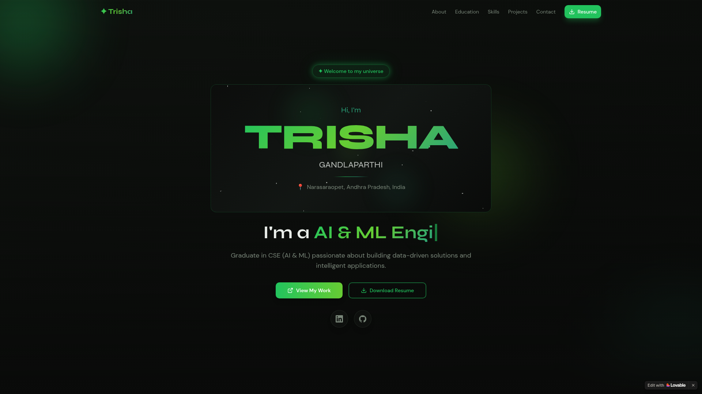

<h1 align="center">✨ Trisha Gandlaparthi — Portfolio</h1>

<p align="center">
  
  
  
  
  
  
</p>

<p align="center">
  A modern, animated personal portfolio website showcasing my skills, projects, education, and experience as an AI & ML Engineer.
</p>

<p align="center">
  <a href="https://trisha-ai-canvas.lovable.app">🌐 Live Demo</a>
</p>

---

## 📸 Screenshot



---

## ✨ Features

- 🌟 **Animated Starfield Background** — Realistic twinkling stars across the entire site
- 🎨 **Modern Dark Theme** — Sleek green-on-black design with glowing accents
- 💬 **AI Chatbot** — Interactive assistant powered by AI
- 📱 **Fully Responsive** — Works beautifully on all screen sizes
- 📄 **Resume Download** — One-click PDF resume download
- 📬 **Contact Form** — Messages saved to cloud database
- 🎭 **Smooth Animations** — Powered by Framer Motion
- 🔗 **Social Links** — LinkedIn & GitHub integration

---

## 🛠️ Tech Stack

| Technology | Purpose |
|---|---|
| React 18 | UI Framework |
| TypeScript | Type Safety |
| Vite | Build Tool |
| Tailwind CSS | Styling |
| Framer Motion | Animations |
| shadcn/ui | UI Components |
| Lovable Cloud | Backend & Database |

---

## 🚀 Getting Started

```bash
# Clone the repository
git clone https://github.com/YOUR_USERNAME/YOUR_REPO_NAME.git

# Navigate to the project
cd YOUR_REPO_NAME

# Install dependencies
npm install

# Start development server
npm run dev
```

---

## 📁 Project Structure

```
src/
├── components/
│   ├── Hero.tsx          # Hero section with typing animation
│   ├── About.tsx         # About me section
│   ├── Education.tsx     # Education timeline
│   ├── Skills.tsx        # Technical skills grid
│   ├── Projects.tsx      # Featured projects
│   ├── Internships.tsx   # Internship experience
│   ├── Certificates.tsx  # Certifications
│   ├── Contact.tsx       # Contact form
│   ├── ChatBot.tsx       # AI chatbot
│   ├── ParticleBackground.tsx  # Starfield animation
│   └── ui/               # shadcn/ui components
├── pages/
│   └── Index.tsx         # Main page layout
└── integrations/
    └── supabase/         # Backend integration
```

---

## 📄 License

This project is licensed under the **MIT License** — see the [LICENSE](LICENSE) file for details.

---

<p align="center">
  Made with 💚 by <strong>Trisha Gandlaparthi</strong>
</p>
